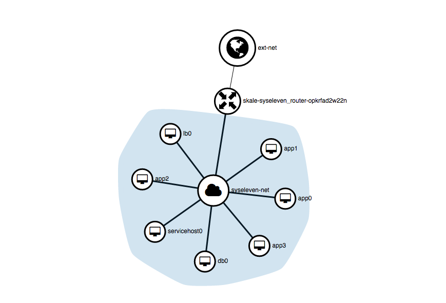

# Distributed Setup with loadbalancer, database server and a dynamic number of application servers.


## Overview

 With this example we demonstrate a cluster setup with the following features:

- a loadbalancer
- a server group with dynamic numbers of servers
- a database server
- a bastion host



These servers are provisioned only with cloud-init/ shell scripts. For service discovery we use consul.

Any node installs consul via cloud-init/ a simple shell script.  
Any node joins a cluster with the first three nodes in the internal network range.
 
Any node has service checks, that announce it's services to the whole cluster.  
The loadbalancer for example distributes requests across all application servers, if their checks are green.

If the bastion host (called "servicehost") and the loadbalancer as proxy are completely deployed you can gain an overview of your setup using the consul webui. The webui is reachable via http://\<loadbalancerIP\>:8080

## How to start this setup

* add your public SSH key to clustersetup-env.yaml 
* Start the setup:

```
openstack stack create -t clustersetup.yaml -e clustersetup-env.yaml <stack_name>
```


