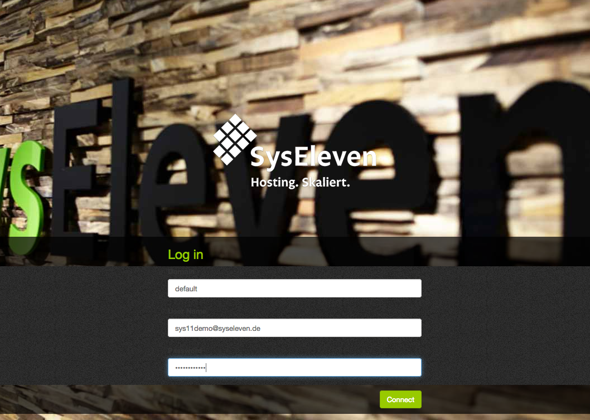
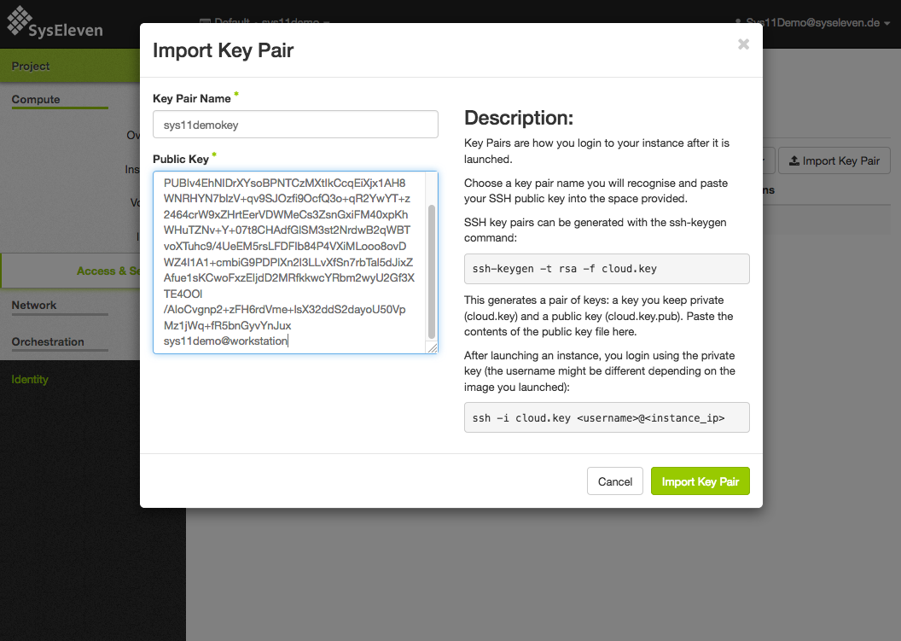
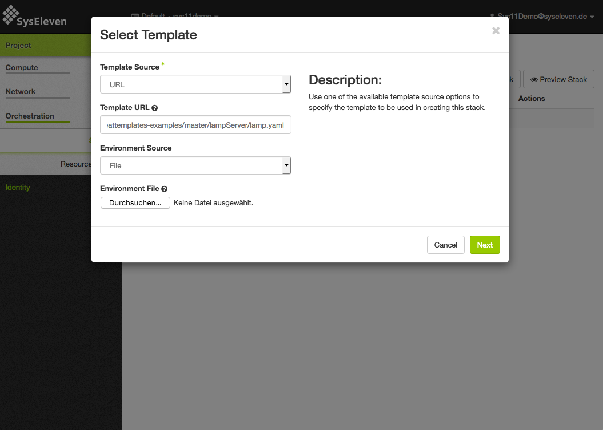
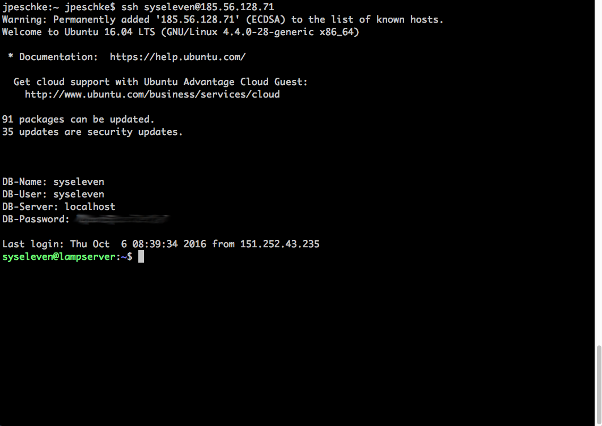

# LampServer


## Login

Using the username and password (API credentials) that were provided by SysEleven we log in at: [https://dashboard.cloud.syseleven.net](https://dashboard.cloud.syseleven.net).



## Importing SSH-key

* In order to import your SSH key using the dashboard, we go to "Compute" and "Access And Security" and from there to "Key Pairs".
* There we select "Import Key Pair", give the key pair a name (that we remember for later use) and import the public part of the key pair via copy & paste into the interface.

Once submitted we can use the key pair with this name in the API and Templates.



## Starting the compute instance

* Navigate to *Orchestration --> Stacks --> Launch Stack* to start a template.
* Select "URL" in the *Template Source* select box.
* Paste the URL of the template into *Template URL*:
`https://raw.githubusercontent.com/syseleven/heattemplates-examples/master/lampServer/lamp.yaml`
* Don't change the field *Environment Source* and click *Next*.
* Write "lampserver" into the field *Stackname*.
* Write the name of our public SSH key as parameter *key_name*.
* Afterwards we click *Launch* and our first instance starts.



## Login to the compute instance
* To log in to our compute instance, we have to gather its IP address. We can find it at *Compute* --> *Instances* in the field *Floating IP* for our new compute instance.

We can check if we can connect to our instance on Mac and Linux in a terminal with the following command:
```shell
ssh syseleven@<myfloating-IP-Address>
```



In the background, the web server, database server and an up-to-date PHP version are being installed.
We can check the progress with the following command:
```shell
tail -f /var/log/cloud-init-output.log
```

Furthermore, you can now place any PHP application to `/var/www/html` and test it.
