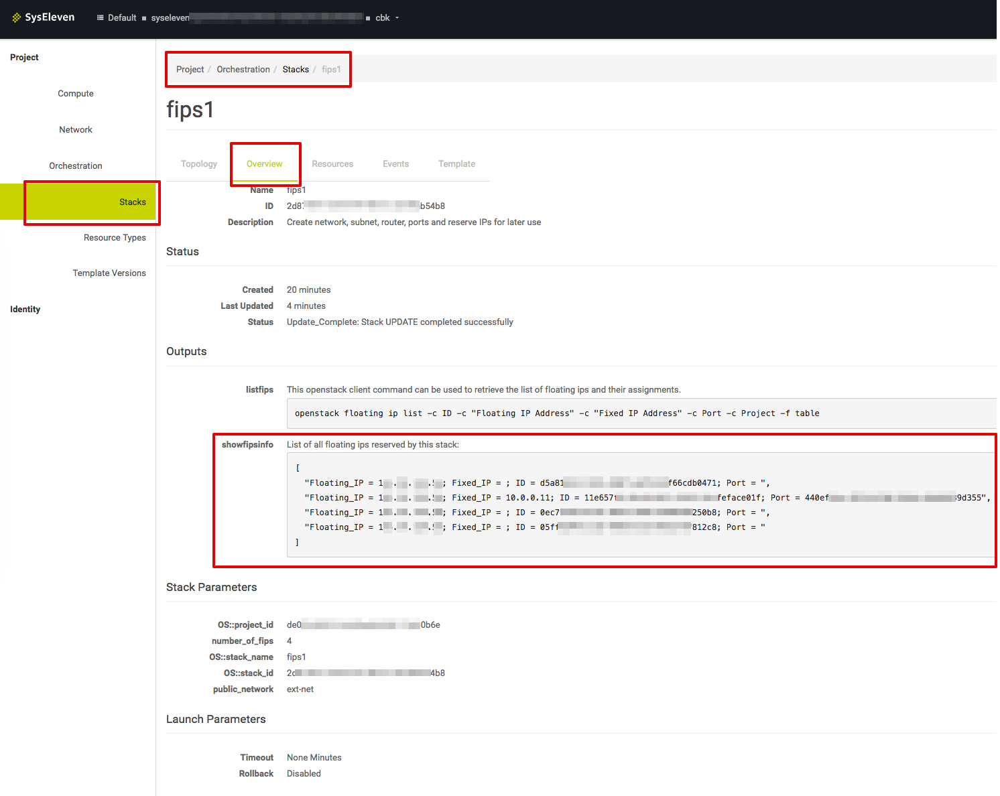

# Reserve Floating IPs

## Overview

Using this template you can reserve floating IPs that can be associated with ports later on. You only need to adjust the number of required floating IPs in the parameter
section of the main template. The stack overview shows the current association(s) of its FIP(s) in the outputs section.



## Usage

### Initial launch

Set the number of required FIPs in the parameter.

Create a stack with this template
```
$ openstack stack create -t 1.1_reserve_floating_ips.yaml <new stackName>
```

### Upgrade/Changes

Adjust the number of required FIPs in the parameter.

Update the existing stack with this template
```
$ openstack stack update -t 1.1_reserve_floating_ips.yaml <existing stackName>
```

## Code organisation

The file 1.1_reserve_floating_ips.yaml references the resources in 1.2_reserve_fip.yaml via the resource group. The property count controls the number of times the resources in reserve_fip.yaml will be created.

## Parameters

**public_network**  
References the external network connected to the internet.

**number_of_fips**  
Defines number of fips to be created.

## Outpus

**list_fips_via_cli**  
Provides the command that can be used to show a list of all floating IPs within the current project.

**fips_info**  
Shows a table containing all reserved FIPs and their current association status.