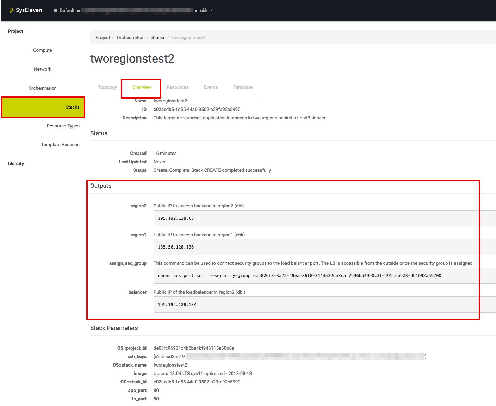

# Two Regions application behind LoadBalancer

## Overview

Using this template you can launch a simple application setup split over two regions and behind a load-balancer. You only need to enter your ssh key in the parameter
section of the `masterstack-env.yaml` template.  
The stack overview shows the FIP(s) as well as the security group assignment command example in the outputs section.

## Usage

### Initial launch

- Configure your ssh key in the parameter of the `masterstack-env.yaml` template.
- Create a stack with this template: `openstack stack create -t masterstack.yaml -e masterstack-env.yaml <new stackName>`
- Once the stack creation has finished and every resource was built the LB port requires a security group. The command how to assign the security group to the LB port is shown in the output section of the masterstack. It needs to be executed in region dbl, since the load-balancer runs there.

## Code organisation

The file masterstack.yaml references the resources in region.yaml and balancer.yaml via heat substacks.

## Parameters

**app_port**  
Defines the app port used for instances.

**lb_port**  
Defines the port used for the load-balancer.

**ssh_keys**  
Defines the ssh keys to be used for instances.

**image**  
Defines the image to be used for instances.

**public_network**  
References the external network connected to the internet.

## Outputs

**assign_sec_group_cli**  
Provides the command that can be used to assign the security group to the load-balancer port to make it available from the outside.

**region1**  
Public IP to access backend in region1 (cbk)

**region2**  
Public IP to access backend in region2 (dbl)

**balancer**  
Public IP of the loadbalancer in region2 (dbl)
