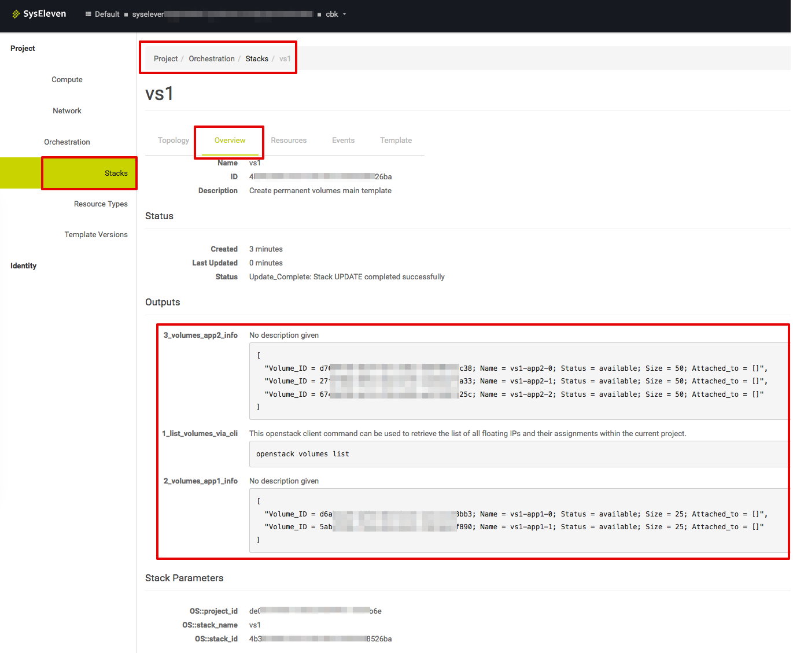

# create volumes

## Overview

Using this template you can create volumes that can be attached to instances later on. You only need to adjust the
number of required volumes and their sizes in the main heat template. This is useful if you want to manage volumes
separately from stacks that manage instances and their association. Volumes of a resource group should be used for
 a single or at least a specific group of instances.
The stack overview shows the current association(s) of its volumes(s) in the outputs section.



## Usage

### Initial launch

Copy and configure the required Volume blocks in the main heat template.

Create a stack with this template

```shell
openstack stack create -t 1.1_volumes.yaml <new stackName>
```

### Upgrade/Changes

Copy and configure the required volume blocks in the main heat template.

Update the existing stack with this template

```shell
openstack stack update -t 1.1_volumes.yaml <existing stackName>
```

## Code organisation

The file 1.1_volumes.yaml references the resources in 1.2_create_volumes.yaml via resource groups. The property count controls the number of times the resources (volumes) in 1.2_create_volumes.yaml will be created.

## Parameters

**volume_name**  
Basename of the volumes which will be extended by the index of its resource group.

**volume_size**  
Size of each volume that will be created.

## Outputs

**list_volumes_via_cli**  
Provides the command that can be used to show a list of all volumes within the current project.

Output example based on this heat example configuration:

```shell
+--------------------------------------+---------------+--------+------+------------------------------------+
| ID                                   | Name          | Status | Size | Attached to                        |
+--------------------------------------+---------------+--------+------+------------------------------------+
| 1fc8e1bf-69a6-468a-b64f-d296a9872ae0 | xxxxxxxxxxx-0 | in-use |   25 | Attached to host_app1 on /dev/vdb  |
| fac825883-c599-4abd-8b99-3ff1b673ce9 | xxxxxxxxxxx-1 | in-use |   25 | Attached to host_app1 on /dev/vdc  |
| 0a025880-716c-469a-9549-6296aeaf29d9 | yyyyyyyyyyy-0 | in-use |   50 | Attached to host_app2 on /dev/vdb  |
| 00ff6060-c1c9-46bd-8057-0dffb5f221ab | yyyyyyyyyyy-1 | in-use |   50 | Attached to host_app2 on /dev/vdc  |
| 0c8e1b60-61v6-46bd-8057-3ff1b67221ab | yyyyyyyyyyy-2 | in-use |   50 | Attached to host_app2 on /dev/vdd  |
+--------------------------------------+---------------+--------+------+------------------------------------+
```

**volumes_info**  
Shows a table containing all volumes and their current attachment status.